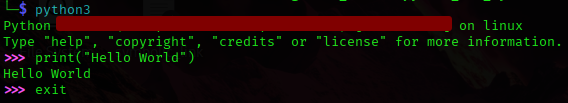

# 1. Headings

# Title
## Title
### Title


# 2. Text Space

row 1

row 2


# 3. Styling Text

Bold --> **This is bold text**

Italic --> _This is italicized_ or *This is italicized*

Strikethrough --> ~~This was mistaken text~~

Bold and nested italic --> **This text is _extremely_ important**

All bold and italic --> ***All this text is important***

Subscript --> This is a <sub>subscript</sub> text

Superscript --> This is a <sup>superscript</sup> text

Underline --> This is an <ins>underlined</ins> text


# 4. Quoting text

Text that is not a quote

> Text that is a quote


# 5. Quoting code

Use `git status` to list all new or modified files that haven't yet been committed.

Some basic Git commands are:
```
git status
git add
git commit
```


# 6. Color Models
The background color is `#ffffff` for light mode and `#000000` for dark mode.


# 7. Links
This site was built using [GitHub Pages](https://pages.github.com/).


# 8. Section links
## Example headings

### Sample Section

### This'll be a _Helpful_ Section About the Greek Letter Θ!
A heading containing characters not allowed in fragments, UTF-8 characters, two consecutive spaces between the first and second words, and formatting.

### This heading is not unique in the file

TEXT 1

### This heading is not unique in the file

TEXT 2

## Links to the example headings above

Link to the sample section: [Link Text](#sample-section).

Link to the helpful section: [Link Text](#thisll-be-a-helpful-section-about-the-greek-letter-Θ).

Link to the first non-unique section: [Link Text](#this-heading-is-not-unique-in-the-file).

Link to the second non-unique section: [Link Text](#this-heading-is-not-unique-in-the-file-1).


# 9. Relative links
[Contribution guidelines for this project](docs/CONTRIBUTING.md)


# 10. Custom anchors
## Section Heading

Some body text of this section.

<a name="my-custom-anchor-point"></a>
Some text I want to provide a direct link to, but which doesn't have its own heading.

(… more content…)

[A link to that custom anchor](#my-custom-anchor-point)


# 11. Line breaks
- Include two spaces at the end of the first line.

This example  
Will span two lines

- Include a backslash at the end of the first line.

This example\
Will span two lines

- Include an HTML single line break tag at the end of the first line.

This example<br/>
Will span two lines

- If you leave a blank line between two lines, both .md files and Markdown in issues, pull requests, and discussions will render the two lines separated by the blank line:

This example

Will have a blank line separating both lines


# 12. Images
## Basic display images (from local)



## Basic display images 2 (from internet)


# 13. Lists
You can make an unordered list by preceding one or more lines of text with -, *, or +.

- George Washington
* John Adams
+ Thomas Jefferson

1. James Madison
2. James Monroe
3. John Quincy Adams


# 14. Nested Lists
1. First list item
   - First nested list item
     - Second nested list item


# 15. Task lists
- [x] #739
- [ ] https://github.com/octo-org/octo-repo/issues/740
- [ ] Add delight to the experience when all tasks are complete :tada:


# 16. Using emojis
@octocat :+1: This PR looks great - it's ready to merge! :shipit:

# 17. Footnotes
Here is a simple footnote[^1].

A footnote can also have multiple lines[^2].

[^1]: My reference.
[^2]: To add line breaks within a footnote, prefix new lines with 2 spaces.
  This is a second line.


# 18. Alerts
> [!NOTE]
> Useful information that users should know, even when skimming content.

> [!TIP]
> Helpful advice for doing things better or more easily.

> [!IMPORTANT]
> Key information users need to know to achieve their goal.

> [!WARNING]
> Urgent info that needs immediate user attention to avoid problems.

> [!CAUTION]
> Advises about risks or negative outcomes of certain actions.

# 19. Hiding content with comments
You can tell GitHub to hide content from the rendered Markdown by placing the content in an HTML comment.
<!-- This content will not appear in the rendered Markdown -->

# 20. Ignoring Markdown formatting
Let's rename \*our-new-project\* to \*our-old-project\*.


# Additional Note
1. To run `.md` files in `VSCode`, you can use this shortcut `Ctrl+Shift+V`.
2. You can create a new paragraph by leaving a blank line between lines of text.

#
**Reference: https://docs.github.com/en/get-started/writing-on-github/getting-started-with-writing-and-formatting-on-github/basic-writing-and-formatting-syntax**